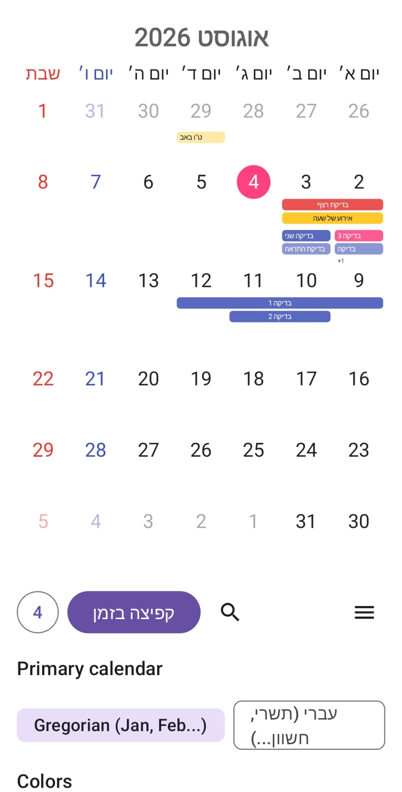
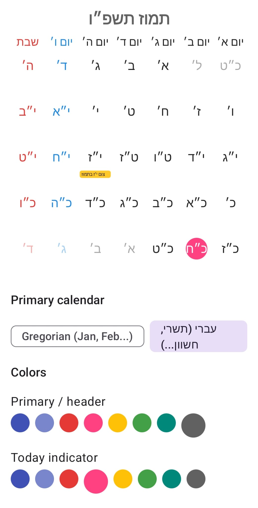
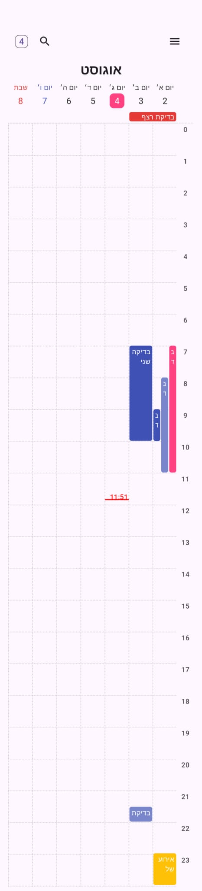
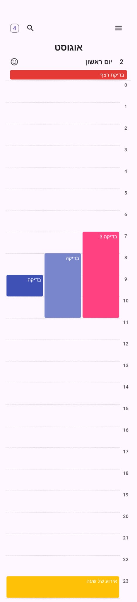
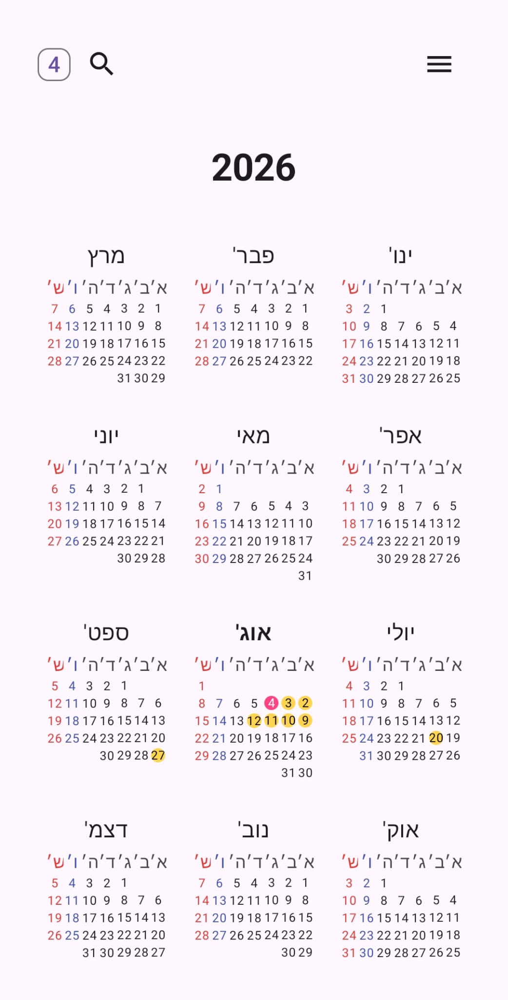
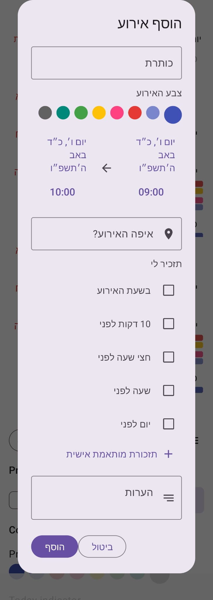
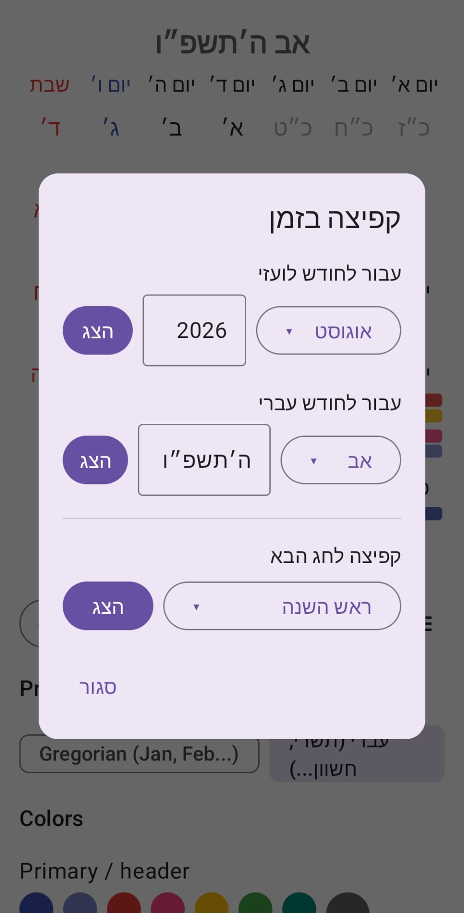

# MyCalendar

An Android calendar library with **genuine Hebrew calendar support** — not a Gregorian grid with Hebrew numbers pasted on top, but a real molad-based Hebrew↔Gregorian conversion algorithm, traditional Hebrew letter-numerals (כ״ז, not "27"), and a full Jewish + Christian holiday calendar with historically accurate deferral rules (fasts that move off Shabbat, Yom Ha'atzmaut's day-of-week shifts, and so on).

Built as a multi-module Android project, on top of a from-scratch implementation of the Hebrew calendar's own arithmetic. On top of that base, the demo app has grown into a complete personal calendar: four full views (year/month/week/day), event search, sharing, exact-time reminders, and holiday notifications.

## Modules

| Module | What it is |
|---|---|
| `calendar-core` | Pure Kotlin, **zero Android dependency**. Date conversion math, the theming model, and the holiday calendars. Compiles and unit-tests on a plain JVM — no emulator needed. |
| `calendar-view` | The actual library — `HebrewCalendarView`, a Canvas-drawn custom Android `View` for the month grid. |
| `app` | 	A demo "Theme Studio" app: live theme editing, calendar-system switching, four calendar views (Month/Week/Day/Year), Time Jump, event search, and event management with reminders, location/notes, .ics sharing, and holiday notifications. |

## Features

### Calendar math
- **Real Hebrew calendar math.** Molad-based Hebrew↔Gregorian conversion, verified against Hebcal/Chabad.org reference dates across a leap year, a common year, and a Hebrew-new-year boundary — not assumed correct, checked.
- **Two calendar systems, swappable at runtime.** Gregorian or Hebrew as the primary display. Hebrew mode organizes the grid by the *real* Hebrew month (its own start/end dates, its own 29- or 30-day length) — not a Gregorian month relabeled.
- **Hebrew letter-numerals.** Days and years render as כ״ז / ה׳תשפ״ו, following standard gematria rules (including the thousands prefix and the ט״ו/ט״ז substitution that avoids spelling a name of God).
- **A full holiday calendar, not just the headline ones.** Major Yamim Tovim, all four public fasts plus Ta'anit Esther (each with its own real deferral rule — most defer to Sunday if they'd land on Shabbat, but Ta'anit Esther uniquely defers *backward* to Thursday), and the modern Israeli holidays (Yom Ha'atzmaut, Yom HaZikaron, Yom HaShoah, Yom Yerushalayim), including their day-of-week-dependent date shifts. A second, independent Christian holiday provider proves the holiday system is genuinely pluggable, not Jewish-only.
- **RTL-aware.** Mirrors Sunday-on-the-right / Saturday-on-the-left under a Hebrew locale, matching how the native OS calendar renders — across every view, not just the month grid.

### Four calendar views
- **Month** — the original Canvas-drawn grid (HebrewCalendarView): swipeable, holiday chips, a continuous banner for multi-day events, live event dots.
- **Year** — a 3×4 grid of mini month-calendars (Jan–Dec, RTL reading order), each showing Friday/Saturday coloring and a highlight on any day with an event. Tapping a month jumps straight into the month view for it. Swipe left/right to change year.
- **Week** — an hourly grid with a dotted-line hour/day grid, events positioned by actual start/end time and laid out side by side when two overlap, a live-updating "now" line confined to today's own column, and swipe to change week.
- **Day** — the same hourly-grid engine as the week view, narrowed to a single column, sharing its lane-packing and time-offset logic rather than duplicating it.

All four are reachable from a single view-switcher menu (☰), and share the same event data underneath.

### Events
- **Time Jump ("קפיצה בזמן").** Jump directly to any Gregorian month/year, any Hebrew month/year, or the next occurrence of any Jewish or Christian holiday, each in its own section with its own "הצג" button — and each remembers your last selection between visits.
- **Event search.** Live substring search across all events (not prefix-only), results grouped by day, with a tap-through detail screen offering edit, share, and delete.
- **Per-day event management.** Add, edit, and delete events with a title, start/end time (so an event can genuinely span multiple days), color, location, and notes. Reminders fire as real Android notifications, with a custom picker for dialing in any number of minutes/hours/days/weeks before the event (up to 5 reminders per event), on top of the fixed presets.
- **Share events as real calendar files.** Export any event as an RFC 5545 .ics file with a readable filename,  through the standard Android share sheet — recognized as an actual calendar attachment by apps like WhatsApp, not just pasted-in text.

### Notifications
- **Silent holiday-greeting notifications.** A "<חג> שמח!" notification on the day of any enabled Jewish or Christian holiday, on its own notification channel separate from event reminders. Delivered via a daily WorkManager background job so it still arrives if the app hasn't been opened that day, with per-day/per-holiday de-duplication so it's never repeated.
- **Reminder notifications** — a separate, high-importance channel from holiday greetings, since a user may want to mute one but not the other.

### Persistence & theming
- **Persisted locally.** Theme, calendar-system choice, and events survive an app restart (SharedPreferences + hand-rolled JSON — no external dependency, matching the "lightweight, drop-in" design goal of `calendar-core`).
- **Fully themeable.** Every color, cell shape, and text size is configurable, live-previewed in the included Theme Studio app.

## Watch the App in Action

▶️ **Demo video:** [Click here to watch the video](https://youtu.be/L-vA5OA5w5U)

## Validation

`calendar-core` has zero Android dependency by design, which means its date-conversion algorithm was compiled and unit-tested completely independently of Android — before the custom `View` or the app even existed. See [`docs/ALGORITHM_VALIDATION.md`](docs/ALGORITHM_VALIDATION.md) for the exact reference dates it was checked against (Hebcal, Chabad.org, OU.org, USHMM), including a 6-year round-trip test and the modern-Israeli-holiday deferral rules.

## Architecture note

Calendar math (`calendar-core`) is deliberately separated from Android UI (`calendar-view`). That split is what makes the algorithm itself independently testable, and would let `calendar-core` be reused outside Android entirely (a backend service, a Kotlin Multiplatform target) without dragging in the Android SDK.

The month view's own rendering engine (HebrewCalendarView) lives in the separate calendar-view module for the same reason; the year/week/day views are Jetpack Compose screens in app instead, since they're static or simply-gestured layouts that don't need Canvas-level custom drawing the way a continuously-swiped month grid does. The week and day views share their event-layout and time-grid math directly (the day view is, structurally, the week view narrowed to one column) rather than duplicating it.

## 📂 Project Structure

```
Calendar/
├── app/                              # Demo "Theme Studio" app: live theme editing, calendar-system switching, event management with reminders
│   ├── src/main/
│   │   ├── AndroidManifest.xml
│   │   ├── java/dev/yahaveliyahu/calendar/ui/theme/
│   │   │   ├── Color.kt
│   │   │   ├── Theme.kt
│   │   │   └── Type.kt
│   │   ├── kotlin/dev/yahaveliyahu/calendar/
│   │   │   ├── AnnualCalendarView.kt          # Year view: 3x4 grid of mini month-calendars
│   │   │   ├── AppStorage.kt                  # SharedPreferences persistence
│   │   │   ├── DailyCalendarView.kt           # Day view: single-column hourly grid
│   │   │   ├── EventIcsSharer.kt              # Builds and shares a real .ics file for an event
│   │   │   ├── EventSearchDialog.kt           # Event search + detail screen (edit/share/delete)
│   │   │   ├── HolidayCheckWorker.kt          # WorkManager job behind the daily holiday check
│   │   │   ├── HolidayNotificationScheduler.kt  # Silent "<holiday> שמח!" notifications
│   │   │   ├── MainActivity.kt
│   │   │   ├── ReminderReceiver.kt            # Fires the actual reminder notification
│   │   │   ├── ReminderScheduler.kt           # Exact-alarm scheduling + permission handling
│   │   │   ├── ThemeStudioScreen.kt           # Main screen: month view host, settings, add/edit event
│   │   │   ├── TimeJumpDialog.kt              # Jump to a specific date or holiday
│   │   │   └── WeeklyCalendarView.kt          # Week view: hourly grid, shared with the day view
│   │   └── res/                       # drawables, mipmap, values, xml (incl. file_paths.xml for the ICS FileProvider)
│   ├── src/androidTest/
│   ├── src/test/
│   ├── build.gradle.kts
│   └── proguard-rules.pro
├── calendar-core/                     # Pure Kotlin, zero Android dependency
│   ├── src/main/kotlin/dev/yahaveliyahu/calendar_core/
│   │   ├── CalendarSystem.kt
│   │   ├── CalendarTheme.kt           # Includes CalendarEvent (now with location/notes)
│   │   ├── EventSerializer.kt
│   │   ├── HebrewMath.kt
│   │   ├── HebrewMonth.kt
│   │   ├── HolidayProvider.kt
│   │   └── ThemeSerializer.kt
│   ├── src/test/kotlin/dev/yahaveliyahu/calendar_core/
│   │   └── HebrewCalendarSystemTest.kt
│   └── build.gradle.kts
├── calendar-view/                     # The actual library — HebrewCalendarView (month grid)
│   ├── src/main/
│   │   ├── AndroidManifest.xml
│   │   ├── kotlin/dev/yahaveliyahu/calendar_view/
│   │   │   └── HebrewCalendarView.kt
│   │   └── res/values/
│   │       └── attrs.xml
│   ├── src/androidTest/
│   ├── src/test/
│   ├── build.gradle.kts
│   ├── consumer-rules.pro
│   └── proguard-rules.pro
├── gradle/
│   ├── wrapper/
│   │   ├── gradle-wrapper.jar
│   │   └── gradle-wrapper.properties
│   └── libs.versions.toml
├── build.gradle.kts
├── gradle.properties
├── gradlew
├── gradlew.bat
└── settings.gradle.kts
```

## 📸 Screenshots

| Gregorian Month | Hebrew Month | 
|---|---|
|  | |

| Weekly Calendar | Daily Calendar | Annual Calendar | 
|---|---|---|
|  | | |

| Add Event Screen | Time Jump | 
|---|---|
|  | |


